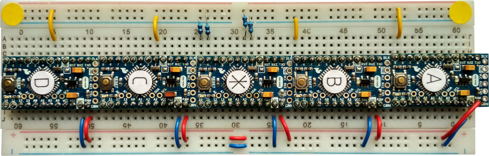

Introduction
============

*MultiTrans* is a multi channel transceiver, for AVR based Arduinos.

Features
--------

  * *Transceiver:* Each pin can receive and transmit *at the same time*.

  * *Multi channel:* Multiple pins can transceive simultaneously.

  * *Collision detection:* One pin can start sending without worrying if the
    other side is sending as well. Collisions are automatically detected and
    circumvented. No information is lost.

Limitations
-----------

  * Buffers:

      + The buffer on the transmitting end can contain 256 bits at the most. For
        each character, 21 bits are necessary. This equates to 12 characters.

      + The buffer on the receiving end can only contain up to 255 pin change
        events.

      + Flushing the buffer on the receiving end takes some time.

    The system is thus best used for short bursts of data with sufficient idle
    time in between.

  * On rare occasions, i.e. if timing is just *right*, collision detection may
    fail. For that reason it is suggested to use higher level error correction.
    
  * It only works with AVR based Arduinos. In fact, code so far has only been
    tested with the Arduino Pro Mini.

  * Timers are occupied:
  
      + 8-bit Timer/Counter2 (TC2), for transmitting
      
      + 16-bit Timer/Counter1 (TC1), for receiving

Debug mode
==========

Debug mode is enabled by passing a template parameter to `MultiTransceiver`. In
this mode additional information is collected, which slows down processing of
interrupts. Therefore the data rate may need to be reduced when debug mode is
enabled.

Character encoding
==================

Transmitted are individual characters. Timing diagram:

There is no additional protocol.

Coding conventions
==================

Coding conventions are based on the [Arduino Style Guide for Writing
Libaries][1] with additions:

  * Class (not struct) member variables (not constants) are prefixed with an
    underscore.

  * Identifiers of template parameters:

      + types: `T`, `U`, `V`, …

      + typed parameters: `t`, `u`, `v`, …

  * Constants follow the same naming conventions as variables.

  * Maximum line length: 80 characters

  * Maximum identifier length: 32 characters

  * To avoid naming conflicts with other Arduino libraries, `#pragma once`
    instead of include guards is used, except for the top level include file.

Test
====

Components for testing:

  * Arduino Pro Mini, ATmega328P, 5V, 16Mhz (on some of them, I desoldered the
    power LED)

  * breadboard

  * FTDI adapter

  * cable to power Arduinos from USB with 5V

  * jumper cables

  * 470 Ω resistors (to prevent shorting in case of programming errors)

Note: There is a bug with templates in Arduino IDE 1.8.5’s compiler. So, use a
compiler that comes with a newer version of the IDE.

Five Arduinos are connected, each of them being a multi-channel transceiver:

  * ⊛, the center Arduino, connected to Ⓐ (pin 8) and Ⓑ (pin 9), Ⓒ (pin 2), Ⓓ
    (pin 3)

  * Ⓐ, connected to ⊛ (pin 2)

  * Ⓑ, connected to ⊛ (pin 3)

  * Ⓒ, connected to ⊛ (pin 9)

  * Ⓓ, connected to ⊛ (pin 8)

For testing, the Arduinos are first synchronized after starting up. Ⓐ, Ⓑ, Ⓒ, and
Ⓓ wait for signals from ⊛. Then all five start sending and receiving. To
estimate if the Arduinos are in sync, look at the LEDs blinking. If they’re
powered up in the wrong order, then one of them may never start sending! The
synchronization is quite primitive, and it’s a good idea to proceed as follows:

 1. Remove the FTDI and any power from all Arduinos.

 2. Make sure that the FTDI is connected to the computer and that the serial
    console is started.

 3. Plug in near simultaneously – i.e. within about a second – the power
    connection as well as the FTDI on the Arduino that should be monitored. The
    green lights should flash in sync at least once at the very beginning.

Synchronization is not strictly necessary for the test to run. It is there to
test the rare case that all Arduinos are transmitting in exactly the same
moment.

License
=======

Except where noted otherwise, files are licensed under the WTFPL.

Copyright © 2018 [Felix E. Klee](felix.klee@inka.de)

This work is free. You can redistribute it and/or modify it under the terms of
the Do What The Fuck You Want To Public License, Version 2, as published by Sam
Hocevar. See the COPYING file for more details.

[1]: https://www.arduino.cc/en/Reference/APIStyleGuide
