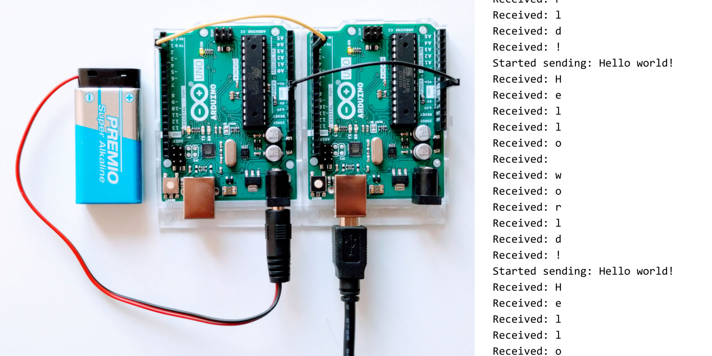
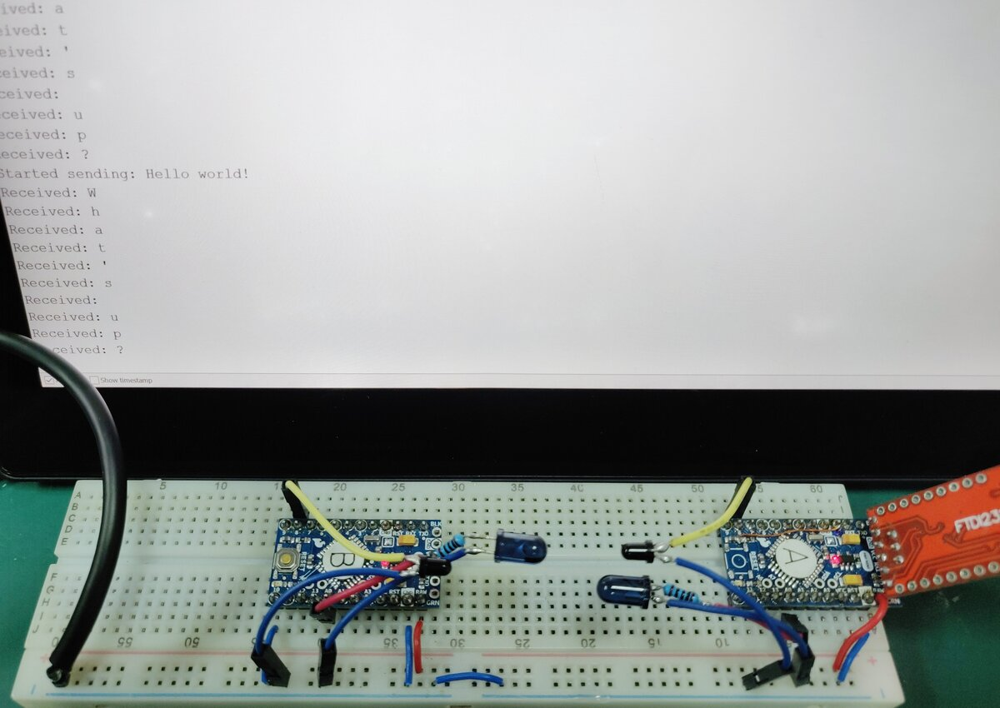

Introduction
============

*MultiTrans* is a multi channel transceiver, for AVR based Arduinos connected by
wire or via IR.

Features
--------

  * *Transceiver:* Transmit and receive *simultaneously* via a *single pin*. (No
    clock line needed.)

  * *Multi channel:* Multiple pins can transceive simultaneously.

  * *Collision detection:* One pin can start sending without worrying if the
    other side is sending as well. Collisions are automatically detected and
    circumvented. No information is lost.

  * *Infrared option:* Bi-directional communication through air, if needed.
    Further communication channels may be possible as well but have been
    untested.

  * Maximum uni-directional data rates on an Arduino Uno / Pro Mini:
  
      + Communication with one peer: 12 kbit/s
      
      + Communication with four peers: 3 kbit/s
      
    Bi-directional data rates are a little less than half of the above rates in
    each direction.
    

Limitations
-----------

  * Buffers:

      + The buffer on the transmitting end can contain 256 bits at the most. For
        each character, 21 bits are necessary. This equates to 12 characters.

      + The buffer on the receiving end can only contain up to 255 pin change
        events.

      + Flushing the buffer on the receiving end takes some time.

    The system is thus best used for short bursts of data with sufficient idle
    time in between.

  * No built-in error checking. You may want to implement your own
    error checking, to take care of:

      + If you have a flaky connection between the Arduinos, for
        example due to bad electrical contacts, then bits may get
        lost.

      + Theoretically, i.e. if timing is perfectly *right*, the
        collision detection built into *MultiTrans* may fail resulting
        in bit loss.

  * It only works with AVR based Arduinos. In fact, code so far has only been
    tested with the Arduino Pro Mini and the Arduino Uno.

  * Timers are occupied:
  
      + 8-bit Timer/Counter2 (TC2), for transmitting
      
      + 16-bit Timer/Counter1 (TC1), for receiving

Examples
========

  * [Simple](examples/Simple/README.md): bi directional communication between
    two Arduinos
    
    
  
  * [Triangle](examples/Triangle/README.md): Arduinos communicating in a triangle
    
    
  
  * [Stress test](examples/StressTest/README.md) (advanced): for testing maximum
    and minimum data rates with five Arduinos all communicating simultaneously
    
    

  * [IR](examples/IR/README.md): bi directional communication through air
    
    

Character encoding
==================

Transmitted are individual characters. Timing diagram:

There is no additional protocol.

Coding conventions
==================

Coding conventions are based on the [Arduino Style Guide for Writing
Libaries][1] with additions:

  * Class (not struct) member variables (not constants) are prefixed with an
    underscore.

  * Identifiers of template parameters:

      + types: `T`, `U`, `V`, …

      + typed parameters: `t`, `u`, `v`, …

  * Constants follow the same naming conventions as variables.

  * Maximum line length: 80 characters

  * Maximum identifier length: 32 characters

  * To avoid naming conflicts with other Arduino libraries, `#pragma once`
    instead of include guards is used, except for the top level include file.
    
  * Comments are written with Markdown syntax.

License
=======

Except where noted otherwise, files are licensed under the WTFPL.

Copyright © 2018–19 [Felix E. Klee](felix.klee@inka.de)

This work is free. You can redistribute it and/or modify it under the terms of
the Do What The Fuck You Want To Public License, Version 2, as published by Sam
Hocevar. See the COPYING file for more details.

[1]: https://www.arduino.cc/en/Reference/APIStyleGuide
