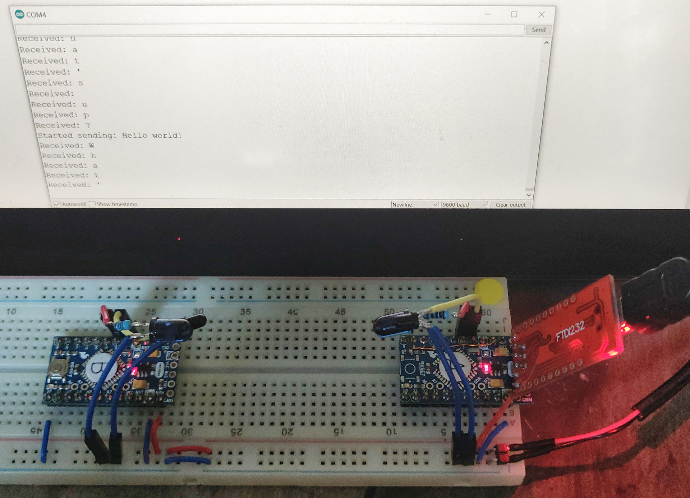

Pictured components:

  * 2 × Arduino Pro Mini

  * 2 × IR LED: TSAL6200 (940 nm, angle of half intensity: ϕ = ± 17°)

  * 2 × IR photo transistor: LTR-4206E (940 nm)

  * 2 × Current limiting resitor for IR LED: 100 Ω

To run the example, power the Arduinos and monitor the serial console of one of
them.

For testing, it is recommended to let the Arduinos send different strings, to
make sure that they’re not simply receiving what they’re sending.
