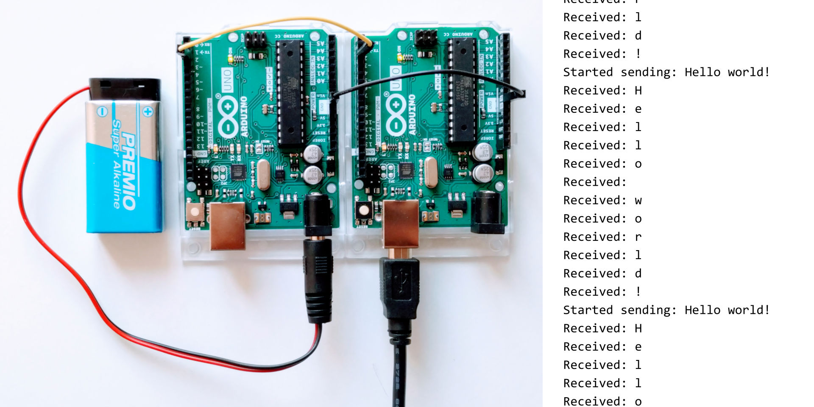

Pictured components:

  * 2 × Arduino Uno Rev3

  * power supply

  * USB cable

The Arduinos are connected via pin 2. To run the example, power the Arduinos and
monitor the serial console of one of them.
