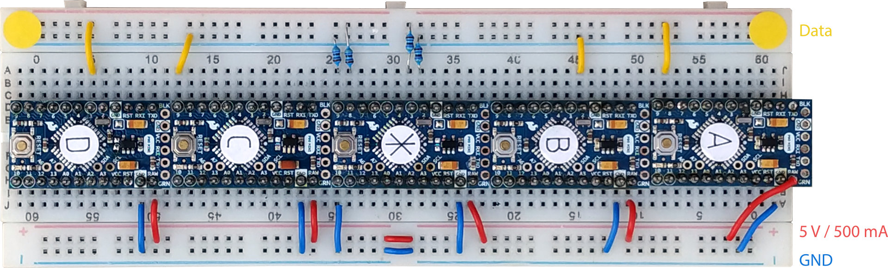

Components used for testing:

  * 5 × Arduino Pro Mini, ATmega328P, 5V, 16Mhz (for reasons not related to this
    test, I desoldered the power LED on some of the boards - just in case you
    notice that)

  * breadboard

  * FTDI adapter

  * cable to power Arduinos from USB with 5V

  * jumper cables

  * 470 Ω resistors (not strictly needed, just to prevent shorting in case of
    programming errors)

Five Arduinos are connected, each of them being a multi-channel transceiver:

  * ⊛, the center Arduino, connected to Ⓐ / pin 8 and Ⓑ / pin 2, Ⓒ / pin
    9, Ⓓ / pin 3

  * Ⓐ, connected to ⊛ / pin 3

  * Ⓑ, connected to ⊛ / pin 2

  * Ⓒ, connected to ⊛ / pin 9

  * Ⓓ, connected to ⊛ / pin 8

For testing, the Arduinos are first synchronized after starting up. Ⓐ, Ⓑ, Ⓒ, and
Ⓓ wait for signals from ⊛. Then all five start sending and receiving. The
synchronization is not super robust, and so it's a good idea to proceed as
follows:

 1. Remove the FTDI and any power from all Arduinos.

 2. Make sure that the FTDI is connected to the computer and that the serial
    console is started.

 3. Plug in the power connection. Eventually – possibly after step 4 – the LEDs
    on all Arduinos should emit a fast triple-flash to indicate sync.

 4. Quickly thereafter – in order not to miss any messages – plug the FTDI into
    the Arduino that should be monitored. (If the Arduino resets, then repeat
    the procedure, possibly after fixing the electronic setup.)

Synchronization is not strictly necessary for the test to run. It is there to
test the rare case that all Arduinos are transmitting the exact same data in the
exact same moment.

Use `settings.h` for configuring tests. Find settings for individual tests in
sub directories, together with results.
