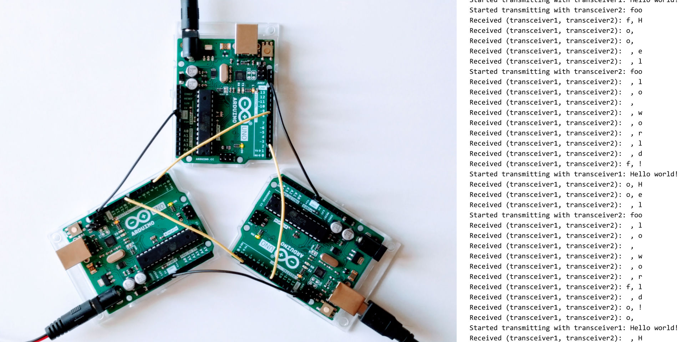

Pictured components:

  * 3 × Arduino Uno Rev3

  * 2 × power supply

  * USB cable

The Arduinos are connected in a triangle. For each Arduino: Pin 2 is connected
to pin 8 of the neighboring Arduino.

To run the example, power all Arduinos and monitor the serial console of one of
them.
