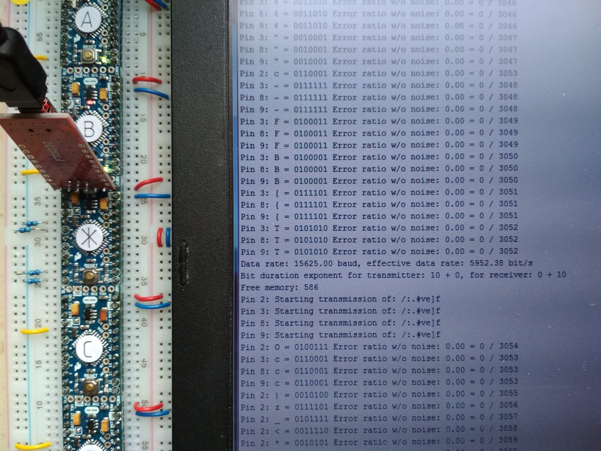
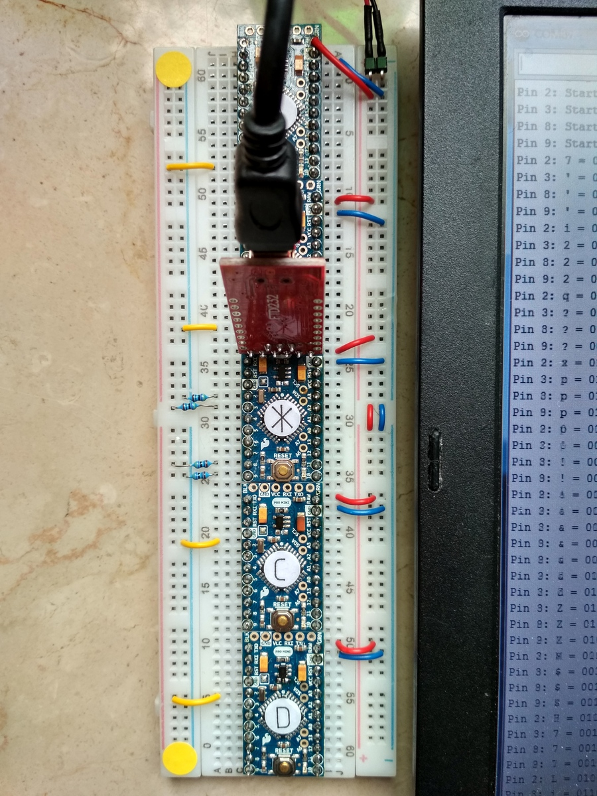

For a video recording, see the [multitrans-test page][1] on Archive.org.

Notes:

  * A bit duration exponent smaller than 10 results in lost bits: about one bad
    character in every 1000 transmitted characters

  * A minimum delay of 1000 ms or less between transmitting data results in
    receive buffer overflows.

[1]: https://archive.org/details/multitrans-test
